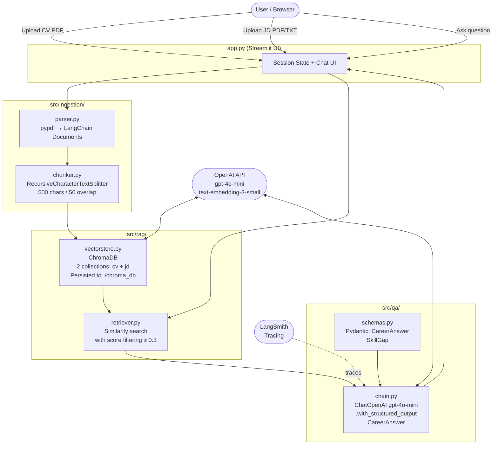
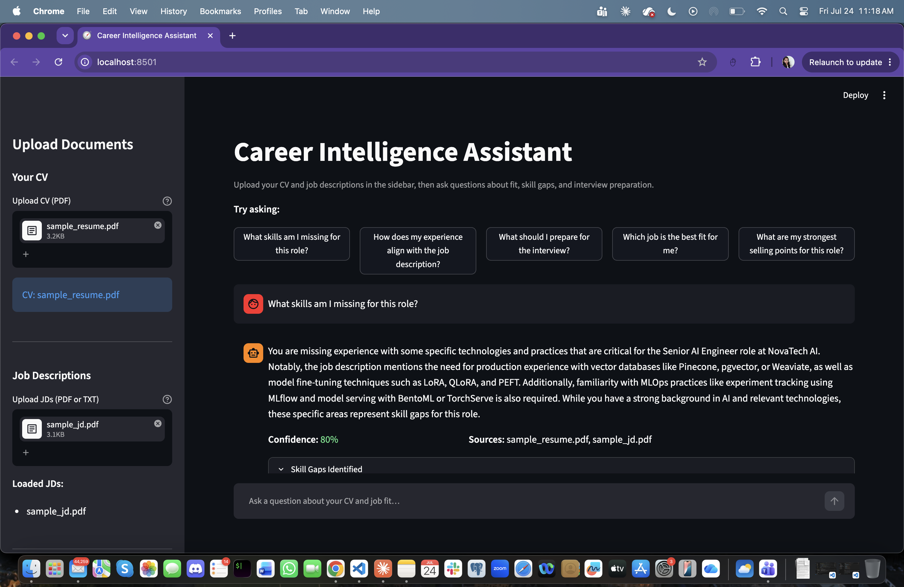
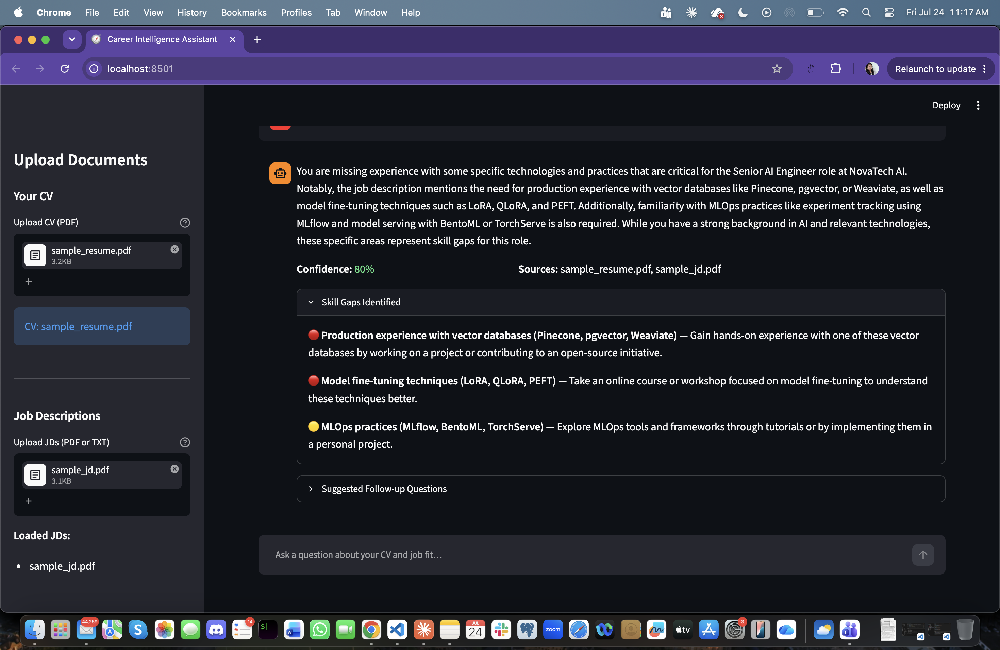
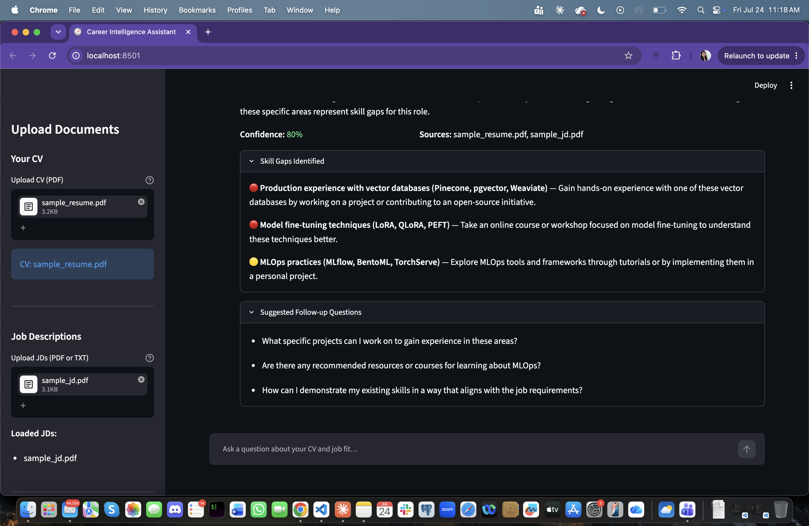

# Career Intelligence Assistant

A full-stack RAG application that lets candidates upload their CV and job descriptions, then ask natural language questions about fit, skill gaps, and interview preparation.

---

## Quickstart

```bash
# 1. Clone and enter the repo
git clone <repo-url> career-intel && cd career-intel

# 2. Add your API keys
cp .env.example .env
# Open .env and fill in:
#   OPENAI_API_KEY   — required for embeddings and the LLM
#   LANGCHAIN_API_KEY — optional, only needed if you want LangSmith tracing

# 3. Install dependencies
make install
# or manually:
python3 -m venv .venv && source .venv/bin/activate
pip install -r requirements.txt

# 4. Run the app
make run
# or:
streamlit run app.py
```

The app opens at http://localhost:8501.

**To run with Docker:**
```bash
make docker-build
make docker-run
```

**To run tests:**
```bash
make test
```

**To run evals (requires OpenAI key):**
```bash
make evals
```

---

## Architecture



---

## RAG and LLM Approach

### Document Ingestion
- **PDF parsing**: `pypdf` extracts text page-by-page. Raises `ValueError` on image-only PDFs rather than silently returning empty context.
- **Chunking**: `RecursiveCharacterTextSplitter` at 500 characters with 50-char overlap. Chosen over token-based splitting because it preserves sentence and paragraph boundaries without requiring a tokeniser at ingest time.

### Embedding and Retrieval
- **Model**: `text-embedding-3-small` — OpenAI's best price/quality tradeoff for semantic search. 1536 dimensions.
- **Vector DB**: ChromaDB with disk persistence at `./chroma_db`. Two separate collections (`cv_documents`, `jd_documents`) so retrieval can be scoped or merged depending on the question.
- **Retrieval strategy**: `similarity_search_with_relevance_scores` returns cosine similarity scores alongside documents. A threshold of 0.3 filters out irrelevant chunks before they reach the LLM. This avoids "context poisoning" from low-signal chunks.
- **Top-K**: 6 chunks across both collections, merged and sorted by score.

### Structured Output (No Hand-Parsed JSON)
The chain uses `.with_structured_output(CareerAnswer)` which constrains the LLM to emit valid JSON matching the Pydantic schema. This means:
- No `json.loads()` anywhere in the codebase
- No `KeyError` at runtime if the LLM omits a field
- Pydantic validates confidence range `[0.0, 1.0]` and skill importance literals at the type level

### Confidence Scoring
The LLM is prompted to set `confidence` based on how well the retrieved context supports the answer — not just how certain it is in general. Low-context queries produce low-confidence answers rather than confident-but-hallucinated ones.

---

## Key Technical Decisions

| Decision | Choice | Reason |
|---|---|---|
| UI framework | Streamlit | 2-day deadline. Solid engineering > flashy UI. |
| LLM | gpt-4o-mini | Best cost/quality for structured output tasks |
| Embeddings | text-embedding-3-small | Strong semantic search, low cost, 1536 dims |
| Vector DB | ChromaDB | Persists to disk — no re-embedding on restart |
| Structured output | `.with_structured_output(CareerAnswer)` | Eliminates hand-parsing, type-safe at runtime |
| Two collections | cv + jd separate | Enables scoped retrieval and cross-collection merge |
| Score threshold | 0.3 cosine | Filters noise without over-filtering relevant chunks |

---

## What Would Be Required to Productionise on AWS

### Compute
- Containerise with Docker (already done), deploy to **AWS ECS Fargate** — no EC2 management, scales to zero between uses.
- Alternatively: **AWS App Runner** for simpler Streamlit deployment.

### Vector Store
- Replace local ChromaDB with **Amazon OpenSearch Serverless** (vector engine) or **Pinecone** for multi-user isolation, horizontal scaling, and managed backups.
- One collection (namespace) per user session, keyed by user ID.

### Authentication
- **AWS Cognito** user pool in front of the app — each user's documents stay private via namespace-scoped collection keys.

### Document Storage
- Uploaded PDFs stored in **S3** (not tempfiles) — durable, auditable, enables async re-processing.
- S3 event triggers **Lambda** for background ingestion to avoid blocking the UI.

### LLM and Embedding
- OpenAI API calls made from **Lambda or ECS** — keep API keys in **AWS Secrets Manager**, not `.env`.
- Rate limiting and retry logic via **tenacity** or a queue (SQS) for burst traffic.

### Observability
- LangSmith already integrated for LLM tracing.
- Add **CloudWatch** metrics for latency, error rate, and per-user token spend.
- Set cost alerts on OpenAI usage.

### CI/CD
- **GitHub Actions** pipeline: `pytest` on PR, docker build + push to ECR on merge to main, ECS deploy.

---

## Engineering Standards

### Followed
- Pydantic structured output — no hand-parsed JSON
- Type annotations throughout
- Failure paths tested (empty documents, below-threshold retrieval, LLM errors, empty questions)
- Semantic similarity evals, not keyword matching
- Docstrings on all public functions explaining the *why*, not the *what*
- ChromaDB persistence — no re-embedding on restart
- `ValueError` raised with clear messages on invalid inputs (empty PDF, empty text, empty question)

### Skipped (and why)
- **FastAPI backend**: Streamlit handles the UI layer — adding FastAPI would introduce a deployment unit with no benefit for a single-user take-home app. In production, I'd add it for multi-user API access.
- **Authentication**: Out of scope for the take-home. Would add Cognito in production.
- **Async ingestion**: File ingestion is synchronous. For production, large PDFs would be queued via SQS + Lambda.
- **Reranking (cross-encoder)**: Would improve retrieval quality for ambiguous queries. Left out to keep complexity in scope.

---

## Screenshots

**Main answer view** — 80% confidence, sources cited, structured response:



**Skill gaps** — critical gaps (🔴) and nice-to-have gaps (🟡) with suggestions:



**Follow-up questions** — suggested next questions based on the answer:



---

## How AI Tools Were Used

I used Claude to speed up the boilerplate parts like Pydantic schemas and test scaffolding. The system prompt went through a few iterations after testing with real documents because the first version wasn't specific enough about the output format.

Decisions like rank-based scoring, splitting CV and JD into separate collections, and using structured output instead of parsing JSON from the LLM were things I worked through myself. The ChromaDB negative score issue was something I had to debug after seeing the retriever return empty results.

The eval dataset covers one case per behaviour so failures are easy to trace.

---

## What I'd Do Differently With More Time

1. **Reranking**: Add a cross-encoder reranker (e.g., `cross-encoder/ms-marco-MiniLM-L-6-v2`) between retrieval and generation to improve chunk selection for ambiguous queries.
2. **Streaming responses**: Use `ChatOpenAI` with `streaming=True` and Streamlit's `st.write_stream` for a more responsive feel.
3. **Multi-turn memory**: Add `ConversationBufferMemory` so follow-up questions ("what about the second point?") resolve correctly.
4. **Async ingestion**: Move PDF processing to a background thread so large CVs don't block the UI.
5. **Per-user sessions**: In multi-user deployment, scope ChromaDB collections by session ID (UUID) and clean up on session end.
6. **Eval automation**: Run evals in CI against golden answers after each model upgrade or prompt change.
7. **Metadata filtering**: Add ChromaDB `where` filters so "questions about Job #2" only retrieve chunks from that JD file.
